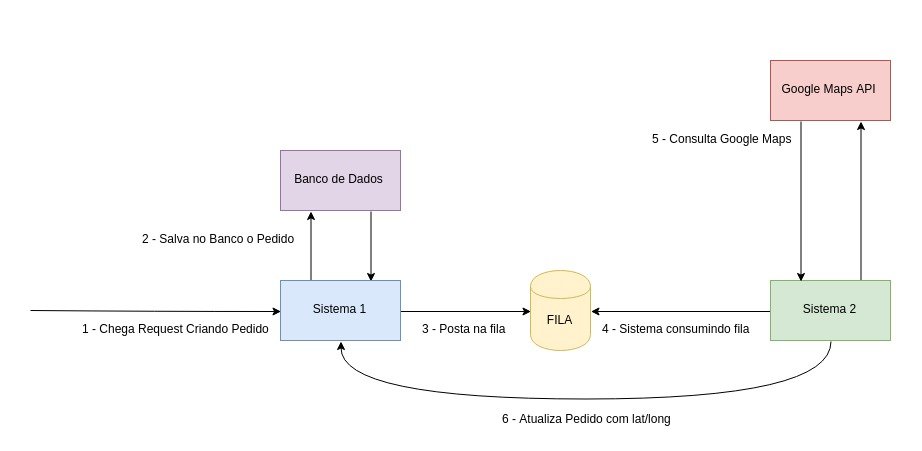

# Descrição

Estamos avaliando várias coisas, incluindo o design (arquitetura) da sua solução, a higiene do código, a legibilidade e a estrutura do código (ex.: quão fácil é para outro(a) programador(a) entender o que o seu código faz), confiabilidade e robustez (os erros são tratados adequadamente?), mas principalmente procuramos boas práticas de código e suas habilidades de programação. Também esperamos testes automatizados.

Julgaremos o bom uso de bibliotecas externas, pois não queremos que você reinvente a roda, entretanto esperamos que haja um equilibro entre uso de bibliotecas e seu código. Especificamente, você pode usar bibliotecas de teste de unidade / build (por exemplo, JUnit). 

Inclua também uma breve explicação da sua arquitetura e suposições, juntamente com seu código e confirme suas alterações de uma maneira que nos ajude a entender suas decisões de arquitetura e código, além de como você chegou à solução final.

Você deve fornecer evidências suficientes de que sua solução está completa, indicando, no mínimo, que ela funciona corretamente nos dados de teste fornecidos. Observe que você será avaliado com base no seu julgamento e na sua execução.

# Contexto

Hoje no GetNinjas trabalhamos com micro-serviços e mensageria, um dos nossos principais fluxos é quando um usuário faz o pedido de algum serviço (seja por meio do site ou aplicativo mobile) e a gente precisa salvar esse pedido, e na sequência fazer uma série de validações e enriquecimentos dos dados de forma assíncrona, para enfim distribuir esse pedido para os(as) nossos(as) profissionais.

# Problema

Após nossa API backend receber uma requisição de novo pedido, uma das coisas que fazemos assíncronamente, é buscar dados geográficos (latitude e longitude) do endereço deste pedido. Para realizar essa ação postamos o endereço e o identificador do pedido em uma fila, onde um outro sistema (responsável apenas por essa tarefa) consome essa fila, consulta a API do Google Maps (ou outra similar) para pegar os dados geográficos (lat/lng) e adiciona estas informações ao pedido.

# Diagrama



# Dados do Pedido

Segue abaixo um exemplo de paylod dos dados do pedido:

```json
{
  "user_info": {
    "phone": "(11) 98765-4321",
    "name": "João da Silva",
    "email": "joao_silva@exemplo.com"
  },
  "address_attributes": {
    "city": "São Paulo",
    "neighborhood": "Jardim Paulista",
    "street": "Avenida São Gabriel",
    "uf": "SP",
    "zip_code": "01435-001"
  },
  "request_info": {
    "question1": "answer1",
    "question2": "answer2",
    "question3": "answer3"
  }
}
```

# Notas

- Para esse teste, os serviços devem ser escritos em uma das 3 linguagens que mais usamos aqui no GetNinjas: Ruby, Python ou NodeJS;
- As aplicações devem rodar dentro de um container docker (cada aplicação em seu container);
- A solução toda deve subir usando docker-compose;
- Pode ser utilizado qualquer tipo de fila (SQS, Sidekiq, RabbitMQ etc);
- Não é necessário seguir a arquitetura proposta no diagrama mas gostaríamos de avaliar uma solução com mais de um serviço se comunicando entre si;
- A solução pode ser entregue de forma incompleta, porém tenha em mente que isso pode impactar na avaliação;
- Não faça squash dos seus commits, gostamos de acompanhar a evolução gradual da aplicação via commits. 
